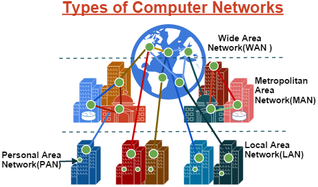

# Apache CA Install

## Steps Required

* **Key generation**
  * Create Private Key
    * ```bash
      sudo mkdir /etc/ssl/mycerts
      sudo openssl genrasa -out /etc/ssl/mycerts/privatekey.priv 2048
      ```
  * Generate/fetch .pem file under ssl/mycerts
    * ```bash
      cat /etc/ssl/mycerts/privatekey.priv
      openssl req -x509 -new -nodes -key /etc/ssl/mycerts/privatekey.priv -sha256 -days 365 -out /etc/ssl/mycerts/localhostCertificate.pem
      ```
* **Adding the Certificate to the server**
  * Create _**extra**_ folder under /usr/local/share/ca-certificates
    * ```
      mkdir /usr/local/share/ca-certificates/extra
      ```
  * Copy .pem file to /usr/local/share/ca-certificates/extra as .crt
    * ```
      cp localhostCertificate.pem /usr/local/share/ca-certificates/extra/localhostCertificate.crt
      ```
  * Update CA Certificates
    * `sudo update-ca-certificates`
  * Enable SSL
    * `sudo a2enmod ssl`
  *   Update the security configuration file

      * nano /etc/apache2/sites-available/default-ssl.conf
      * 


      * SSLCertificateFile `PATH/TO/localhostCertificate.pem` &#x20;
      * SSLCertificateKeyFile `PATH/TO/privatekey.priv`
      * Restart Apache
        * systemctl restart apache2


Extracting public key from private key:

```bash
openssl rsa -in mykey.pem -pubout > mykey.pub
```


