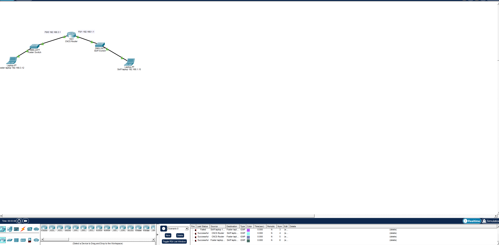

# Lab 14-1: Network Troubleshooting

**Troubleshooting Process:**

1. Gathering information
2. Analyzing information
3. Eliminating possible causes
4. Formulating a hypothesis
5. Testing the hypothesis
6. Solving the problem

**Troubleshooting Methods**

1. The top-down approach
2. The bottom-up approach
3. The divide-and-conquer approach
4. The follow-the-path approach
5. The spot-the-differences approach
6. The move-the-problem approach

**Challenge 1:** [**NET-150-Lab 14-1 Troubleshooting Challenge 1.pkt**](https://champlain.instructure.com/courses/2616866/files/390785723/download?wrap=1)

Foster Laptop should be able to ping Skiff Laptop - but something is wrong!

* Ping requests to the router work
* Ping requests from router to the devices work
  * Either a router issue or a device issue
* Examining the Router configuration doesn't show any issues
* Examining the Skiff Laptop configuration shows no Default Gateway, so we just need to set it to 192.168.1.1
* And we get a successful ping! I think this was a pretty efficient method, and there wasn't too much to look at.&#x20;
*

    <figure><figcaption>
Screenshot of a successful ping from Foster to Skiff
</figcaption></figure>

**Challenge 2:** [**NET-150-Lab 14-1 Troubleshooting Challenge 2.pkt**](https://champlain.instructure.com/courses/2616866/files/390785737/download?wrap=1)[**Download NET-150-Lab 14-1 Troubleshooting Challenge 2.pkt**](https://champlain.instructure.com/courses/2616866/files/390785737/download?download_frd=1)

* The cable connected from the Router to the Switch is red, meaning that the interface isn't configured.
*

    <figure><figcaption>
Screenshot of unconfigured and powered off interface (FastEthernet0/1)
</figcaption></figure>

* We just need to configure it, and we get a good ping!
  *

      <figure><figcaption>
Screenshot of Foster sucessfully pinging Skiff
</figcaption></figure>

* The first ping typically fails due to ARP, so ping it twice before you give up!

**Challenge 3:** [**NET-150-Lab 14-1 Troubleshooting Challenge 3.pkt**](https://champlain.instructure.com/courses/2616866/files/390785729/download?wrap=1)[**Download NET-150-Lab 14-1 Troubleshooting Challenge 3.pkt**](https://champlain.instructure.com/courses/2616866/files/390785729/download?download_frd=1)

* Tried pinging the routers from all devices, but no dice.&#x20;
* Pinging devices in the 10.10 network without the router gets a good ping, so I definitely need to investigate further
* I looked at a lot of the configuration for the devices, and they all seemed right, but then I realized the cables might be mismatched to the wrong ports, and hovering over it shows us that I'm right:
*

    <figure><figcaption>
Screenshot of mismatched cables
</figcaption></figure>

* After rearranging the cables, the devices can now ping each other, and we get successful pings!
  *

      <figure><figcaption>
Screenshot of successful pings between devices
</figcaption></figure>
* I definitely spent a little more time on this one, but I should've moved on quicker after realizing that it was a cable issue, and not actually a configuration issue.&#x20;

**Challenge 4:** [**NET-150-Lab 14-1 Troubleshooting Challenge 4.pkt**](https://champlain.instructure.com/courses/2616866/files/390785725/download?wrap=1)[**Download NET-150-Lab 14-1 Troubleshooting Challenge 4.pkt**](https://champlain.instructure.com/courses/2616866/files/390785725/download?download_frd=1)

PC0, PC1 should be able to ping PC2

Pick one of the Troubleshooting Methods to start troubleshooting. &#x20;

Take notes of what you try

Solve the problem

**Submission for Challenge 4:**

* **Screenshot of successful ping between PC1 and PC2 (1 Point)**
* **Description of Troubleshooting Approach you started with and the steps your took (1 Point)**
* **Description of any issues you encountered, mistakes you made, whether another approach would have been better and/or did you combine methods (1 Point)**

**Challenge 5:** [**NET-150-Lab 14-1 Troubleshooting Challenge 5.pkt**](https://champlain.instructure.com/courses/2616866/files/390785727/download?wrap=1)[**Download NET-150-Lab 14-1 Troubleshooting Challenge 5.pkt**](https://champlain.instructure.com/courses/2616866/files/390785727/download?download_frd=1)

All PC's should be able to ping each other - but something is wrong!

Pick one of the Troubleshooting Methods to start troubleshooting. &#x20;

Take notes of what you try

Solve the problem

**Submission for Challenge 5:**

* **Screenshot of successful ping between Clinic PC 1 and Guest Laptop 2 (1 Point)**
* **Description of Troubleshooting Approach you started with and the steps your took (1 Point)**
* **Description of any issues you encountered, mistakes you made, whether another approach would have been better and/or did you combine methods (1 Point)**

**15 Points Total:** Remember - 10 of the 15 points are based on your descriptions.

 
