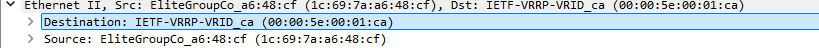
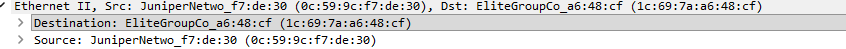
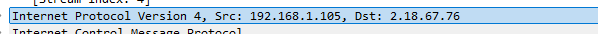
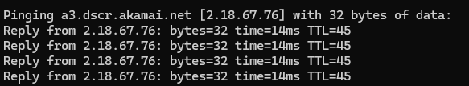
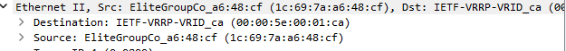

# Lab 2-2: Observing LAN Activity

* _A brief (one sentence) summary describing what you did in the lab._
  * _In this lab, we learned how to use Wireshark, inspected MAC addresses, and pinged IP addresses._
* _Any commands or instructions that you found useful and will need to use again in the future._
  * ping ip\_address
  * tracert ip\_address (Windows)
* _Any problems you ran into during the lab, and what troubleshooting steps you took to fix them._
  * _N/A_

**Ping Request**

<figure><figcaption>
This screenshot shows the ping request made to the default gateway.
</figcaption></figure>

**Ping Reply**

<figure><figcaption>
This screenshot shows the reply from the default gateway. The MAC address is different due to an internal configruation in the cyber.local network. 
</figcaption></figure>

**My MAC**

1C-69-7A-A6-48-CF

**IP Address of Second Ping**

<figure><figcaption>
This screenshot shows the IP address of the second ping.
</figcaption></figure>

<figure><figcaption>
This screenshot shows the ping request being made in the Windows Command Prompt
</figcaption></figure>

**MAC Addresses**

<figure><figcaption>
This screenshot shows the MAC Addresses of the ping request in Wireshark
</figcaption></figure>

* These MAC addresses are the same as last time because the destination MAC address is our default gateway, which redirects all of our traffic to the internet. Our workstation does not know the MAC address of the website, and it is NOT on our internal network. As such, the router needs to **route** the traffic to the website, meaning that our destination will usually only be the router's MAC address.&#x20;

**Questions**

* What is a MAC address, and what are its components?
  * A MAC address is an organizationally unique identifier and consists of 12 hexadecimal digits. The first 6 identify the manufacturer, and the second 6 is the unique device identifier.
* How to get a MAC address.
  * You can get your MAC address by running ipconfig /all or looking at Wireshark.
* What is Wireshark and how to use it.
  * Wireshark is a packet inspection tool, allowing you to see all the information going in and out of your computer. Click on a network interface like "WiFi" or "Ethernet" to start monitoring traffic, and click the stop to end it.  &#x20;
* How to find a protocol in Wireshark.
  * You can search for protocols, like ICMP or HTTP/HTTPS, in the search bar, and it will filter the requests.&#x20;

