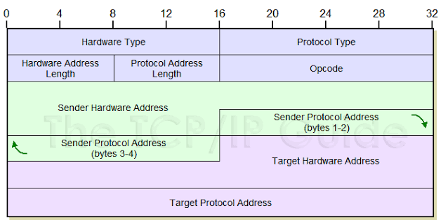

# Week 3 Videos

## Ethernet

* Primary Layer 2 Protocol
  * Not like cables
  * Is a communication paradigm/protocol
* Process
  * Is the line clear?
  * Is not clear -> Collision
  * Send one packet at a time
* Protocols and Headers
  * The frame format
  * 6-byte Destination address
  * 6-byte Source address
  * 2-byte type field
  * At the end there is a 4-bit CRC
* Addresses
  * MAC addresses - 6 bytes
    * 48 bits long
    * 3 bytes are OUI, and 3 identify the device
  * OUI
    * Organization Unit Identifier
    * 24 bits of a MAC address
    * Assigned by IEEE
  * Type field
    * Allows for multiple protocol
    * Indicates the nmext protocol, IPv4, IPv6, ARP, etc.
      * 0x800 IPV4
      * 0x86DD IPV6
      * 0x0806 ARP

## ARP

* Layer 2 addresses and Layer 3 addresses
  * We have a need for address resolution
  * MAC addresses and IP addresses
  * Each hop uses MAC addresses
* Translation from an IP to a MAC address is address resolution
  * Local to a network - Layer 2
  * Encoding the IP address of the intended recipient in a broadcast message
  * A simple request and reply (broadcast to everyone)
* First decision
  * Is whether the destination is local
    * Local
      * Asks broadcast for MAC address
    * Distant network
      * Asks for the MAC address of the default gateway
      * Because that will be the first hop
* Broadcast is MAC: FF:FF:FF:FF:FF:FF

## ARP Format

* 32 bits across&#x20;
  *

      <figure><figcaption></figcaption></figure>

  * Hardware Address Type - 16 bits
    * Ethernet - 1
  * Protocol Address Type&#x20;
    * 0800 for IPv4
  * Hardware Address Length is 6 bytes
  * Protocol Address Length - Specifies the size of the protocol address it is 4 bytes.
  * Opcode is 16-bit field which indicates a request or response
  *

      <figure><figcaption></figcaption></figure>

## ARP Caching

* ARP is effective but inefficient
* Ties up the local network
  * Is Broadcast, so every device processes it
* Caching
  * Don't wait for an answer to come back
  * Keep a small table of IPs to MACs in memory
  * Oldest entry runs out of space or after an entry has not been updated for a long period of time
* arp -a is used to view the table contents
  * Initial timeout of 15-45 seconds.

## MAC spoofing

* MAC addresses are meant to be unique and unchangeable
  * Not true, can be changed very easily
  * You can impersonate other users and systems, you can bypass MAC-based network access controls
* ARP spoofing
  * Malicious actor sends falsified ARP message overs a local area network.
    * Can only occur on a LAN
  * ARP spoofing is not MAC spoofing, all they need to do is to convince whoever they are targetting that the attackers MAC is tied to the legitimate IP
* Example
  * 1: Asking for 10.1.1.1
  * 2: Attacker says 10.1.1.1 is ME!!!!!
  * 2: Other person says 10.1.1.1 is ME, too late.
* Attacker response is chosen over the legit one
  * Gratuitous ARP (never asked for, no request)
  * How a lot of ARP spoofing programs
  * Can be used legitimately
  * Spoofing exploits send out a lot of Gratuitous ARP packets
* Effects
  * Denial of Service
  * Session Hijacking
  * Man in the Middle Attacks

## ARP Spoofing Protections

* Layer 2 Switches use CAN tables (IP to MAC addresses)
* Protections
  * May use static mappings
  * Dynamic ARP inspection
    * Rejects invalid and malicious ARP packets
    * Uses DHCP snooping at the switch level
    * If the packet doesn't match the snooping from DHCP, then it drops it
  *
