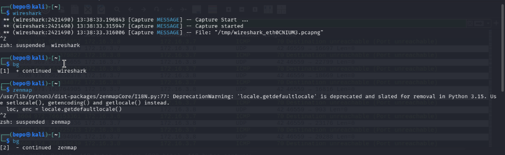
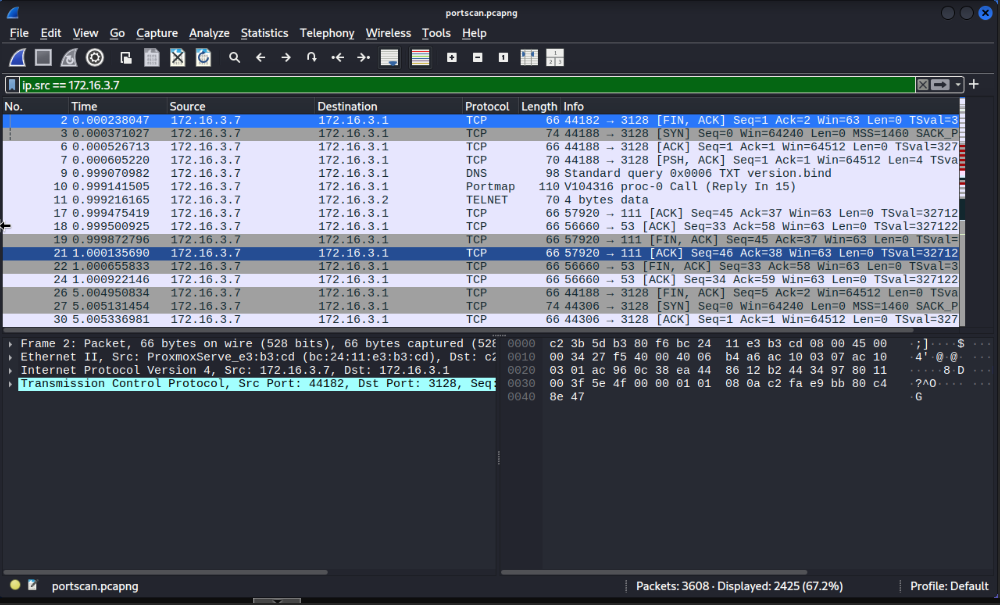
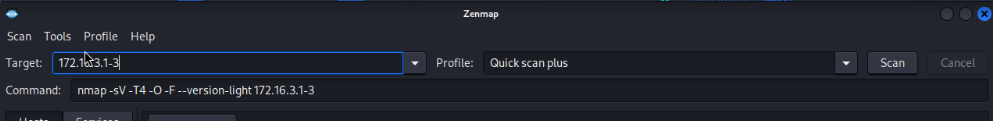
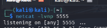
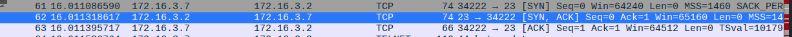
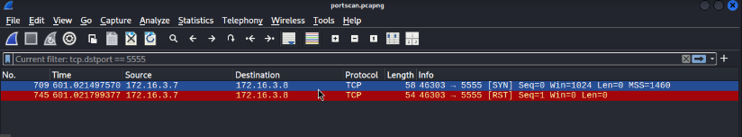
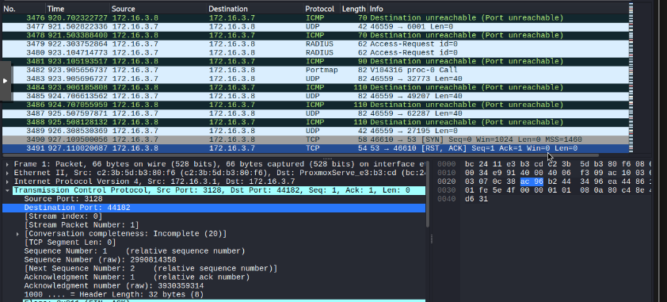

# Nmap Lab

The first step in the Nmap lab is to open our applications. We need to open **Wireshark** and **Zenmap** and we can use the _Ctrl+Z_ shortcut and the `bg` command to keep them running in the background while we use our terminal. If we ever want to close them out, we can enter `fg` and use _Ctrl+C_.

<figure><figcaption>
Screenshot of terminal running Wireshark and Zenmap
</figcaption></figure>

Now that we've opened into WireShark, let's filter by our IP address to see all of our outgoing requests. The format in Wireshark is `ip.src == IP_ADDRESS`. If you ever don't know what to filter by, but you have the data, there's a little trick. For example, if you're looking for TELNET only, and you see a TELNET requests, right click on the TELNET request and select Prepare As Filter > Selected, and it should pop up for you. You can then modify the filter however you'd like. This option should be available for almost every property in Wireshark. &#x20;

<figure><figcaption>
Screenshot of Wireshark Capture
</figcaption></figure>

Our first step is to run a Quick Scan Plus on 3 IP addresses. So we put in a range of `172.16.3.1-3` and start our scan.

<figure><figcaption></figcaption></figure>

**Deliverable 1: Below, create a table with the options and descriptions of what they do.**

* -sV - Service Script Scan - Attempts to identify the running services on ports
* -T4: Reduces TCP timing cap to 10 ms, and is a more aggressive scanning version
* -O: Attempts to identify the operating system version. Is included in -A.
* -F: Fast scan, scans the top 100 ports instead of the default 1000
* –version-light: Reduces the scanning intensity for version detection, equivalent to –version-intensity 2

**Deliverable 2**

Our results are listed below:

<figure><figcaption>
Screenshot of Quick Scan Results (Part 1)
</figcaption></figure>

<figure><figcaption>
Screenshot of Quick Scan Results (Part 2)
</figcaption></figure>

| IP Address  | Ports Open        | Services Running                                  | Operating System   | Filtered Ports v. Closed Ports |
| ----------- | ----------------- | ------------------------------------------------- | ------------------ | ------------------------------ |
| 172.168.3.1 | 22, 53, 111, 3128 | OpenSSH 10.0p2, dnsmasq 2.91, Proxmox VE REST API | MikroTik Router OS | 0 / 96                         |
| 172.168.3.2 | 22, 23            | SSH, Telnet                                       | Linux 5.x          | 0 / 98                         |
| 172.16.3.3  | 22                | OpenSSH                                           | Linux 5.x          | 0 / 22                         |

Now, we move onto the netcat portion of the lab. On another kali machine, we open up port 5555 using `netcat -lvnp 5555` and leave the terminal open.

<figure><figcaption>
Screenshot of Machine #2 opening port 5555 with netcat
</figcaption></figure>

Now, we run an Intense Scan with a UDP profile, and leave it running for 15 minutes. The results are at the bottom.

<figure><figcaption>
Screenshot of Intense UDP Scan
</figcaption></figure>

**Deliverable 3**

* What additional information could you find out about the services the hosts were running?&#x20;
  * All I found out was that port 5555 was open, not much else. It says it might be FreeCiv, but it has a question mark, which means it's just making a guess and has no real info to confirm it. Other than that, no ports were open, which is pretty typical for a Kali machine.&#x20;
* What port number do you see, and can anyone else in the class see it? Be sure to include screenshots.
  * I see port 5555. I am unsure if anyone else in the class can see it, as I'm on my own personal proxmox range.
*

    <figure><figcaption>
Screenshot of port results of Machine #2
</figcaption></figure>

**Deliverable 4**

**Filter for TCP traffic during your Quick Scan Plus. Do you see a full 3-way handshake on any ports? What does the presence or absence of a handshake tell you about whether a port is open or closed?**

Looking at the source traffic, I do see a full 3-way handshake. This means that a good port connection happened and that the port is open. You can see the screenshot below. Any SYN ACK from another device means a good connection.&#x20;

<figure><figcaption>
Screenshot of three way handshake in Wireshark
</figcaption></figure>

<figure><figcaption>
Three way handshake diagram
</figcaption></figure>

We can also see this by filtering by `tcp.flags == 0x0012` which filters by the SYN ACK flags.

**Can you find the netcat traffic in your capture? What port does it appear on, and what protocol is it using?**

I did find the netcat traffic in my capture, but there's not much network traffic, just two packets.

<figure><figcaption>
Screenshot of netcat traffic
</figcaption></figure>

I'm not sure why it automatically sent a reset flag (which closed the netcat connection), but I have my guesses that it was a result of service scanning. It is using just TCP. Running a normal scan (with port 5555 specified) reveals the same thing. This time, it doesn't end up closing the connection.

<figure><figcaption>
Screenshot of plain scan
</figcaption></figure>

When I run a version scan, it does end up closing the netcat connection.

**If you were a defender reviewing this capture without knowing a scan had occurred, what would alert you that a scan was happening? List at least two indicators.**

Mainly I'm looking for volume of requests, and a significant amount of TCP requests with no related traffic. For example, if there's an HTTP port and there's TCP connections coming in without an HTTP connection, something is up. On top of that, I'd look for stealth scanning, which resets the connection before a full handshake is made. So it sees the SYN/ACK and sends a RST flag to avoid firewall logging.&#x20;

It's possible some port scans and looking for very specific ports with a high vulnerability ratio, so corresponding IP addresses to traffic would also be a good indicator.&#x20;

**Export a screenshot of the packet capture timeline. What does the traffic volume tell you about how "loud" an NMap scan is?**

There are over 3,000 requests overall across a few scans, which is a lot of traffic. That being said, your average windows computer (with a lot of software), has typically that much traffic in a minute. Or at least mine does. From this, we know that Nmap scans have a high traffic volume, and are likely very loud.&#x20;

<figure><figcaption>
Screenshot of Wireshark Window
</figcaption></figure>

**Deliverable 5**

**From what you saw, what do you believe are the top 3 security risks on the scanned systems? How would you begin to address these vulnerabilities?**

The top risks that come with running a device on the internet are the following:

* Open ports running outdated software
* Outdated operating systems with vulnerabilities

In our scan, I identified a telnet port (which is actually the updated one that doesn't allow root priv esc) which I would say would be my top priority to address. Telnet should never be used in a production enviornment, and it should be shutdown and replaced with SSH.

The other devices were running OpenSSH which is not really a security vulnerability, just more attack surface. If an attacker gains access to a hash and conducts an offline attack, they might be able to crack the SSH password.&#x20;

**How does network scanning help both attackers and defenders? What does this tell you about regular security audits?**

For attackers, it gives them valuable intel about the machines that they're scanning and how to attack them. For defenders, it gives them the exact same information, but it also tells you what's vulnerable. Understanding your attack surface, and how attackers think, is key to protecting it. You should be consistently scanning your devices for open ports to see whether things change and monitoring for outdated software. You can fight attackers by scanning yourself.

**What are the key differences between “Quick scan plus” and “Intense scan plus UDP”, and when would you use each in a real world scenario?**

A quick scan plus really only looks for the 100 top TCP ports and does light version scanning, which is helpful for identifying most open services. The intense scan on the other hand looks at all TCP **and** UDP ports using heavy version scanning. Unfortunately, UDP repsonses are much slower than TCP connections, because UDP doesn't actually support connections. There's no handshake, just an ICMP repsonse (which takes much longer), that tells you that the port is closed. There are almost 65,536 ports, so that is going to take a much longer time to scan things than a Quick Scan.

I generally default to an intense scan without UDP, which reveals most services, but if you want a full picture, it may benefit you to run a UDP scan as well. That being said, if you have access to these systems, it may just be beneficial to get this information internally using `ss` and `netstat` to get a list of open ports, and then scan those ports from outside the network to see if they're vulnerable.

**Why do you think some ports show as “filtered” instead of “open” or “closed”? What does this tell you about network configuration?**

Filtered means that the network is responding to probes, but something is getting in the way like a firewall. So there theoretically could be a service behind it. Closed ports mean there is no respones. This tells you a few things. If most ports are filtered, there likely is a solid firewall working to keep you out. If it's closed, and there are zero filtered ports, there might be no firewall at all.

**Why is it important to only scan networks and systems you have permission to scan? What could be the consequences of doing so unauthorized?**

Scanning networks you don't own (or without authorization) risks you getting banned from your Internet Service Provider for breaking their Acceptable Use Policy, and is possibly illegal under the Computer Fraud and Abuse Act. This article is pretty fascinating and talks much more than I can about it: [https://nmap.org/book/legal-issues.html](https://nmap.org/book/legal-issues.html)
