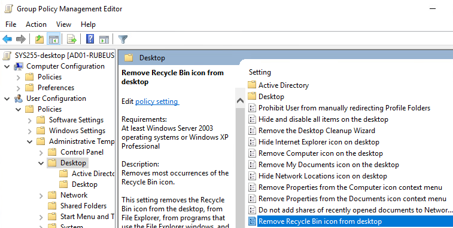

# Lab 5 - AD DS GPO Lab

## Lab

### Creating Organizational Units (OUs)

Go to _Server Manager,_ in the top right, and click _Tools > Active Directory Users and Computers_.


All we need to do is right-click on any the ben.local object, click _New > Organizational Unit,_ and name our OU. We want the structure to look like this:


### Creating Users and Groups, and adding Computers

Right click the Accounts folder, and click _New > Users_. Name the user accordingly, and uncheck _Reset Password on Login_. The accounts should look something like this:

<figure><figcaption></figcaption></figure>

To add a computer to our computer folder, all we need to do is go to _ben.local > Computers_, and drag the WKS01 Computer to the _ben.local > SYS255 > Computers_ OU. Finally, to create a group, we click on Groups and click _New > Group._ We want it to be a Global Security Group with Alice and Bob, but not Charlie. See the photo below:


Double click on the Object and go to Members. Click Add... and add aliceLab5 and charlieLab5.


Too busy ricing your Windows machine? Lock in.


### Creating a new Group Policy

Go to the _Server Manager_ and go to the top right to _Tools > Group Policy Management._ Open up your forest and go down to _SYS255_ and right click and add a new Group GPO, it should be the first item on the menu. Click on the GPO to see its settings.


Go to the Security Filter, and add custom-desktop, and remove Authenticated Users. Add _Domain Computers_ to the Security Filter list. Go to Delegation (on the top) > Advanced... Click on Domain Computers, and click _Deny_ on the _Apply Group Policy_ setting.

### Editing a Group Policy

Right-click on the new Group Policy and click _Edit..._ From there, we can apply any settings we want to disable the Recycling Bin.



If we want to disable the last logon, all we need to do is disable the setting using a group policy:


### Commands to know


```
gpresult /r 
gpupdate /force
gpresult /scope computer /r
```


## Guide for Assessment Prep

Snapshot back to base and rebuild it from scratch! Also, try to rebuild the environment in my own Proxmox Server, and time how long it takes to rebuild everything. YAYYYYY.

### Network Map

<figure><figcaption><p>Network Diagram!!!!</p></figcaption></figure>

